# BIET — Design Diagrams

Thirteen diagrams covering the system as it is built, not as it was planned.
Every box below corresponds to a directory, a module or a table that exists in
this repository. Where a diagram and [`ARCHITECTURE.md`](ARCHITECTURE.md)
disagree, the code was the source.

Diagrams are Mermaid and render on GitHub without a plugin.

| # | Diagram | Answers |
|---|---|---|
| [1](#1-system-context) | System context | Who uses it, what it talks to |
| [2](#2-container--deployment-view) | Container / deployment | What runs where |
| [3](#3-where-the-data-comes-from) | **Data sources → tables** | **Which module the data is from** |
| [4](#4-ingestion-pipeline-m0) | Ingestion pipeline (M0) | How a source row becomes a reference row |
| [5](#5-module-map-m0--m19) | Module map M0–M19 | What the twenty modules are, and their dependency order |
| [6](#6-backend-layer-model) | Backend layer model | The strict layering, and where the engine sits |
| [7](#7-calculation-sequence) | Calculation sequence | What `POST /calculate` actually does |
| [8](#8-value-resolution-chain) | Value resolution chain | How one number gets its value and its provenance |
| [9](#9-engine-dataflow) | Engine dataflow | The arithmetic, module by module |
| [10](#10-database-schema-erd) | Database ERD | The four table groups |
| [11](#11-comparator-intelligence-flow-m11m14) | Comparator intelligence | The only live-at-request-time path |
| [12](#12-frontend-architecture) | Frontend architecture | Slices, steps and result tabs |
| [13](#13-scenario-lifecycle) | Scenario lifecycle | Draft → run → snapshot → export |

---

## 1. System context

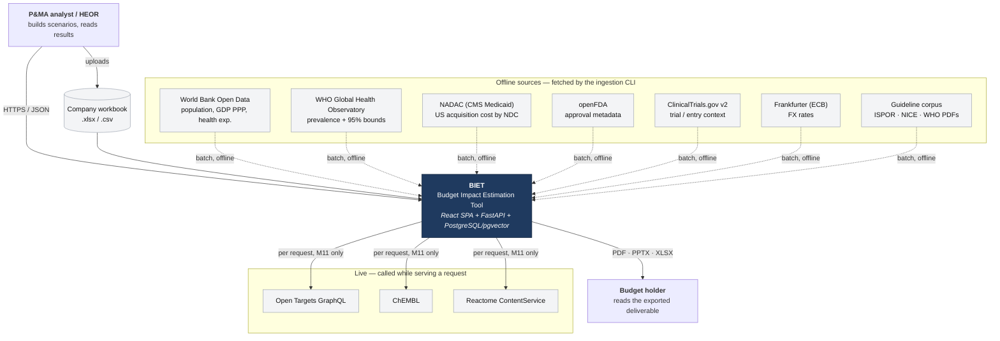

**The one asymmetry worth noticing.** Every source except Open Targets,
ChEMBL and Reactome is offline: it is fetched by a CLI, staged, transformed and
published into PostgreSQL, and the API reads only the database. Comparator
discovery (M11) is the single exception — it calls out while serving the
request, which is why it is the only feature that degrades to "could not reach
the drug database" instead of failing the whole tool.

---

## 2. Container / deployment view

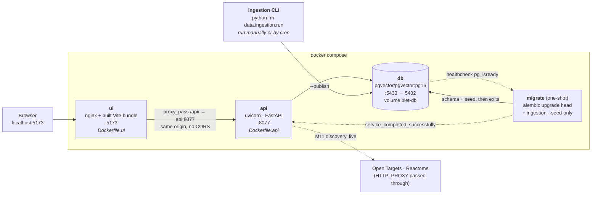

`migrate` is a separate one-shot service rather than an API entrypoint script,
so a failed migration fails visibly instead of leaving an API running against a
schema it does not match.

---

## 3. Where the data comes from

**Short answer: module M0 — Data Foundation & Ingestion, implemented in
`data/`.** Nothing else in the system fetches or parses source data. The API
reads the tables M0 publishes; the engine reads nothing at all.

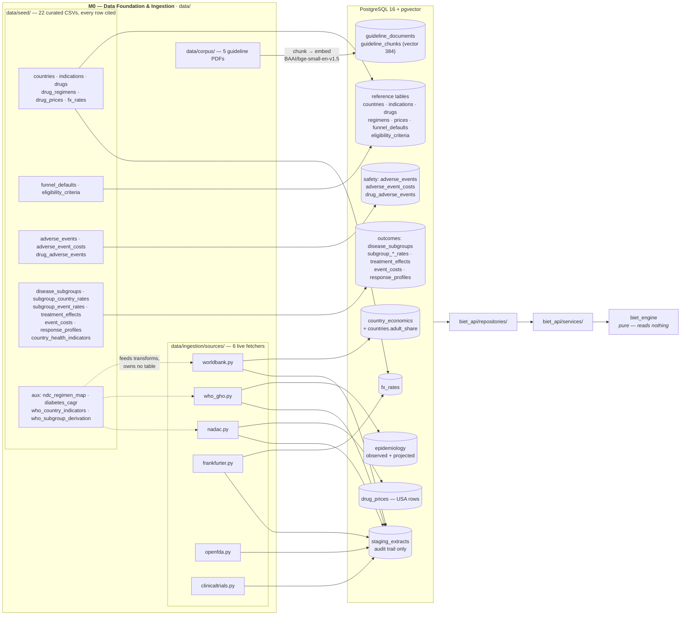

### Source register — what each source supplies and where it lands

| Source | Module / file | Publishes to | On the calculation path? |
|---|---|---|---|
| World Bank Open Data | M0 · `sources/worldbank.py` | `country_economics`, derived `countries.adult_share` | **Yes** — population and affordability denominators |
| WHO GHO | M0 · `sources/who_gho.py` | `epidemiology` (observed + projected row) | **Yes** — prevalence and the PSA interval |
| NADAC | M0 · `sources/nadac.py` | `drug_prices` (USA, via `ndc_regimen_map.csv`) | **Yes** — insulin and generic comparators only |
| Frankfurter (ECB) | M0 · `sources/frankfurter.py` | `fx_rates` | **Yes** — reporting-currency conversion |
| openFDA | M0 · `sources/openfda.py` | `staging_extracts` only | No — metadata |
| ClinicalTrials.gov | M0 · `sources/clinicaltrials.py` | `staging_extracts` only | No — entry context (M14 reads the registry, not this) |
| Curated seed | M0 · `data/seed/*.csv` → `publish/seed.py` | 17 reference/safety/outcome tables | **Yes** — branded prices, funnel defaults, trial effects |
| Guideline PDFs | M0 · `data/corpus/` → `publish/corpus.py` | `guideline_chunks` | No — retrieval grounding for M10 |
| Open Targets / ChEMBL | **M11** · `repositories/comparator.py` | nothing — returned live | Only via M12 promotion |
| Reactome | **M11** · `repositories/comparator.py` | nothing — returned live | Score contribution only |
| Company workbook | **M19** · `services/workbook_service.py` | nothing — becomes editable inputs | Yes, once the user accepts them |

Three things follow from this table, and they are the answers people usually
want:

1. **Branded incretin prices are not from NADAC.** Filtering the 1.5M-row NADAC
   extract to these classes yields 1,204 rows — 1,174 insulin, 30 generic
   liraglutide, zero semaglutide, zero tirzepatide. Branded pricing is curated
   seed (`data/seed/drug_prices.csv`), each row citing a list-price reference
   and a stated gross-to-net assumption.
2. **Nothing imported is saved.** A workbook import lands in the left-hand panel
   as editable values marked as coming from your file; the seeded default stays
   underneath anything the file did not cover.
3. **Every published row carries `source` and `confidence_tier`.** That is a
   contract test, not a convention.

---

## 4. Ingestion pipeline (M0)

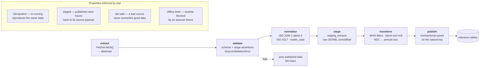

Two transform rules carry most of the correctness weight:

- **Latest non-null year, per indicator, per country, independently.** Health
  expenditure lags population by one to two years; a naive join on one fixed
  year silently discards health expenditure — and therefore affordability — for
  every market.
- **Adult share is 18+, not 15+.** The World Bank publishes a 0–14 band; WHO
  prevalence is 18+. Subtracting an approximated 15–17 cohort
  (`pop_0014_pct × 3/15`) removes a 3.2% (DEU) to 6.4% (IND) overstatement of
  the diseased population. The approximation is tier **B**; supplying an
  observed share via `data/seed/age_bands.csv` upgrades it to **A**.

---

## 5. Module map M0 – M19

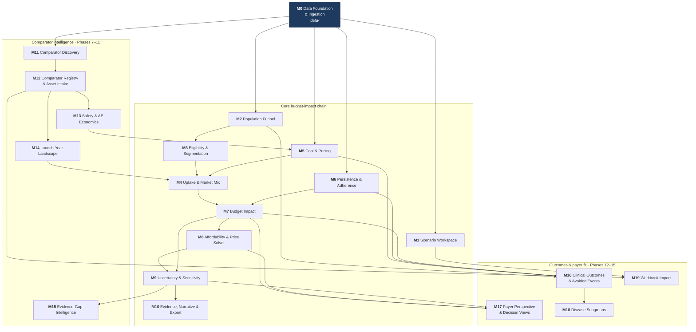

**M0 blocks everything** — it is the only module with no upstream dependency
and the only one that writes reference data. **M12 is the hinge** of the
comparator half: until a discovered molecule can be promoted into a priced
comparator, M13 has nothing to attach a safety profile to and M14 has nothing
to admit into a baseline.

### Module → code map

| Module | Engine | API service | Frontend slice |
|---|---|---|---|
| M0 | — | — (offline) | — |
| M1 | — | `scenario_service.py` | `scenario-builder/` |
| M2, M3 | `funnel.py`, `eligibility.py` | `engine_input.py` | `results/tabs/PopulationTab` |
| M4 | `uptake.py` | `engine_input.py` | `scenario-builder/MarketBurden` |
| M5 | `cost.py`, `fx.py` | `pricing_service.py` | `scenario-builder/PriceGrid` |
| M6 | `persistence.py` | `engine_input.py` | `scenario-builder/InputStudio` |
| M7 | `impact.py` | `calculation_service.py` | `results/tabs/SummaryTab`, `WithWithout` |
| M8 | `affordability.py`, `solver.py` | `calculation_service.py` | `affordability/`, `price-solver/` |
| M9 | `sensitivity.py`, `psa.py`, `distributions.py` | `calculation_service.py` | `results/tabs/UncertaintyTab` |
| M10 | `narrative.py` | `narrative_service.py`, `export_service.py` | `evidence/`, `DeliverableTab` |
| M11 | — | `comparator_service.py`, `comparator_classify.py` | `comparator-discovery/` |
| M12 | — | `comparator_registry_service.py` | `ComparatorRegistry.tsx` |
| M13 | `safety.py` | `safety_service.py` | `results/SafetyComparison` |
| M14 | `landscape.py` | `landscape_service.py` | `MarketAccessTab` |
| M15 | `evidence_gap.py` | `evidence_gap_service.py` | `results/EvidencePriority` |
| M16 | `outcomes.py` | `outcomes_service.py` | `results/tabs/OutcomesTab` |
| M17 | — | `payer_service.py` | `results/tabs/PayerTab` |
| M18 | — | `segmentation.py` | `results/tabs/SubgroupsTab` |
| M19 | — | `workbook_service.py`, `excel_service.py` | `scenario-builder/WorkbookPanel` |

---

## 6. Backend layer model

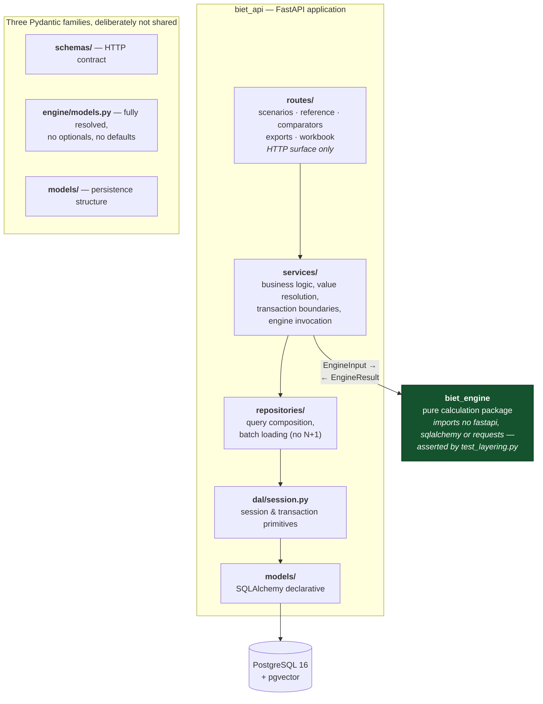

**The one line that matters.** The engine receives fully-resolved primitive
values and returns fully-computed results. It never queries, never reads
configuration, never logs outward. That purity is what makes a run
reproducible: replaying a stored snapshot through the recorded engine version
returns the same answer. `backend/tests/test_layering.py` inspects the module
dependency graph and fails if that is ever violated.

---

## 7. Calculation sequence

`POST /api/v1/scenarios/{id}/calculate`

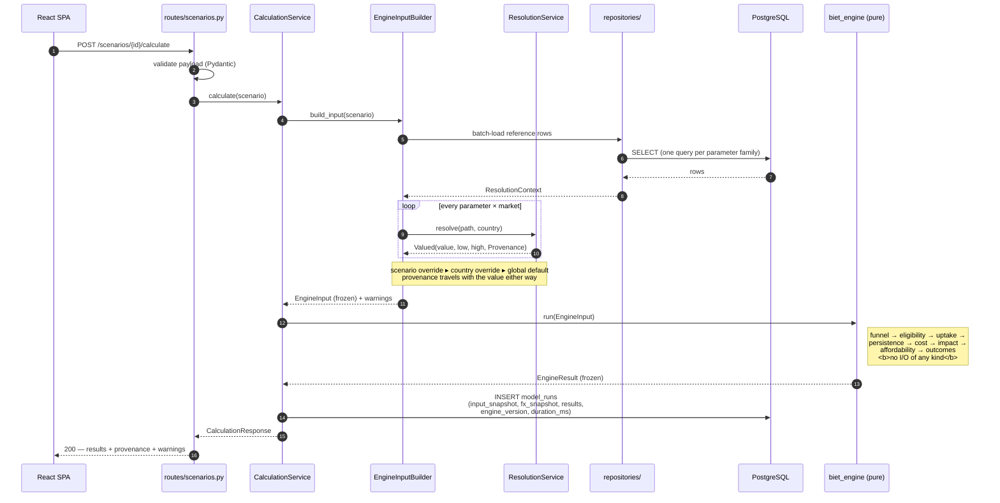

Interactive edits re-enter at step 1 through a 250 ms trailing debounce, with
request cancellation on supersession. Server-side calculation stays the single
source of truth — mirroring the engine in TypeScript would mean two
implementations of the same arithmetic, and they would diverge.

---

## 8. Value resolution chain

Every model input resolves through three ordered levels; the most specific
level present wins, and the interface always shows which one supplied the value
in force.

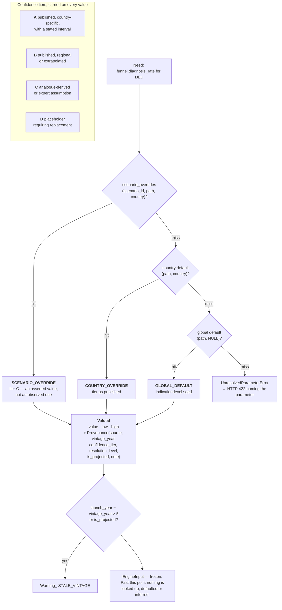

M15 multiplies this tier by M9's swing: a large swing on a tier-A source is
settled; a large swing on a tier-D placeholder is the reason the answer cannot
yet be trusted, and is what turns an uncertainty analysis into a research plan.

---

## 9. Engine dataflow

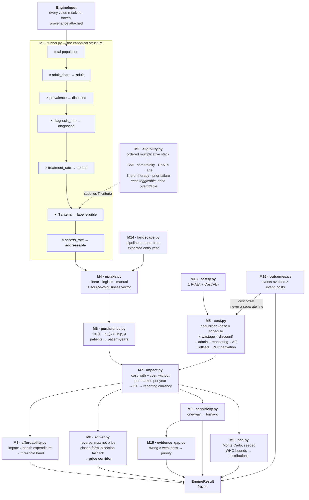

The funnel is never collapsed into a single pre-computed "eligible population"
figure — the visibility of the intermediate stages is what makes the estimate
defensible.

---

## 10. Database schema (ERD)

```mermaid
erDiagram
    COUNTRIES ||--o{ COUNTRY_ECONOMICS : has
    COUNTRIES ||--o{ EPIDEMIOLOGY : has
    COUNTRIES ||--o{ DRUG_PRICES : has
    COUNTRIES ||--o{ ADVERSE_EVENT_COSTS : has
    COUNTRIES ||--o{ EVENT_COSTS : has
    COUNTRIES ||--o{ SUBGROUP_COUNTRY_RATES : has
    COUNTRIES ||--o{ COUNTRY_HEALTH_INDICATORS : has

    INDICATIONS ||--o{ EPIDEMIOLOGY : scopes
    INDICATIONS ||--o{ FUNNEL_DEFAULTS : scopes
    INDICATIONS ||--o{ ELIGIBILITY_CRITERIA : scopes
    INDICATIONS ||--o{ DRUGS : scopes
    INDICATIONS ||--o{ DISEASE_SUBGROUPS : scopes
    INDICATIONS ||--o{ SCENARIOS : scopes
    INDICATIONS ||--o{ COMPARATOR_ASSETS : scopes

    DRUGS ||--o{ DRUG_REGIMENS : has
    DRUGS ||--o{ DRUG_PRICES : has
    DRUGS ||--o{ DRUG_ADVERSE_EVENTS : has
    DRUGS ||--o{ TREATMENT_EFFECTS : has
    DRUGS ||--o{ RESPONSE_PROFILES : has
    DRUGS ||--o| COMPARATOR_ASSETS : "promoted from"

    ADVERSE_EVENTS ||--o{ ADVERSE_EVENT_COSTS : priced_by
    ADVERSE_EVENTS ||--o{ DRUG_ADVERSE_EVENTS : observed_in

    DISEASE_SUBGROUPS ||--o{ SUBGROUP_EVENT_RATES : has
    DISEASE_SUBGROUPS ||--o{ SUBGROUP_COUNTRY_RATES : has

    SCENARIOS ||--o{ SCENARIO_OVERRIDES : carries
    SCENARIOS ||--o{ MODEL_RUNS : produces
    SCENARIOS ||--o| SCENARIOS : "cloned from"

    COMPARATOR_ASSETS ||--o{ COMPARATOR_APPROVALS : has

    GUIDELINE_DOCUMENTS ||--o{ GUIDELINE_CHUNKS : chunked_into

    COUNTRIES {
        char3 country_code PK
        text currency_code
        numeric adult_share "derived, 18+"
        text adult_share_source
        char adult_share_confidence_tier
        bool is_active
    }
    EPIDEMIOLOGY {
        int id PK
        char3 country_code FK
        int indication_id FK
        smallint year
        numeric prevalence_pct
        numeric prevalence_low "WHO 95% bound"
        numeric prevalence_high
        bool is_projected
        char confidence_tier
    }
    DRUG_PRICES {
        int price_id PK
        int drug_id FK
        char3 country_code FK
        numeric price_local
        text price_basis "list|nadac|estimated_net|ppp_derived"
        numeric gross_to_net_pct
        text source_url
        char confidence_tier
    }
    SCENARIOS {
        uuid scenario_id PK
        int indication_id FK
        text asset_name
        smallint launch_year
        smallint horizon_years
        char3[] country_codes
        text perspective
        bigint covered_population
        text[] subgroup_codes
        uuid parent_scenario_id FK
        bool is_baseline
        bool is_archived
    }
    SCENARIO_OVERRIDES {
        int id PK
        uuid scenario_id FK
        char3 country_code "NULL = all markets"
        text parameter_path
        jsonb value
        text note
    }
    MODEL_RUNS {
        uuid run_id PK
        uuid scenario_id FK
        text engine_version "semantic, frozen"
        jsonb input_snapshot
        jsonb fx_snapshot
        jsonb results
        int duration_ms
    }
    COMPARATOR_ASSETS {
        int asset_id PK
        text source_id "ChEMBL id"
        text target_symbol
        text mechanism_of_action
        text[] pathway_ids "Reactome"
        text competitor_class
        numeric relevance
        int expected_entry_year
        int drug_id FK "set on promotion"
        bool is_new_asset
    }
    GUIDELINE_CHUNKS {
        int chunk_id PK
        int document_id FK
        text chunk_text
        vector embedding "384-dim, ivfflat"
    }
    STAGING_EXTRACTS {
        int id PK
        text source_id
        int row_index
        jsonb payload "raw, unmodified"
        timestamptz fetched_at
    }
```

Four logical groups: **reference** (published by M0), **scenario** (written by
M1), **knowledge** (the embedded corpus), and **comparator** (M11/M12).
`staging_extracts` stands apart — it is the audit trail from any published value
back to the source payload it came from, and nothing reads it at request time.

---

## 11. Comparator intelligence flow (M11→M14)

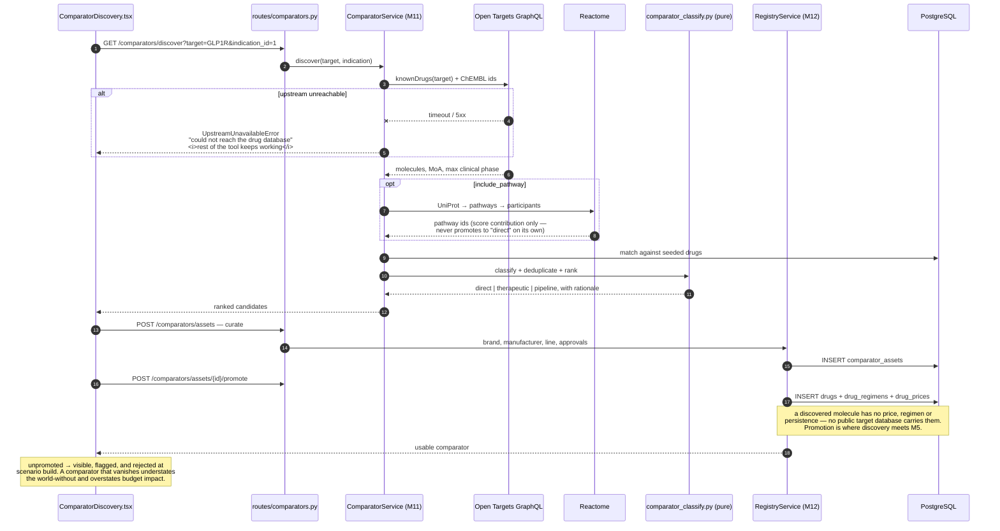

M14 reads `comparator_assets.expected_entry_year` to admit pipeline entrants
into the baseline mix from their entry year. It is **off by default**: every
entrant's price is an assumption, so it is tier-D by construction, warned about,
and belongs in a scenario variant rather than the base case.

---

## 12. Frontend architecture

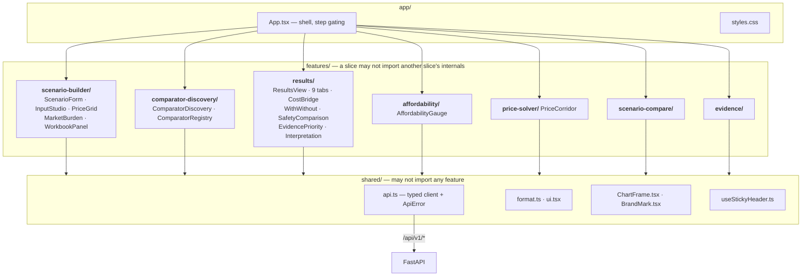

### The four steps, in dependency order

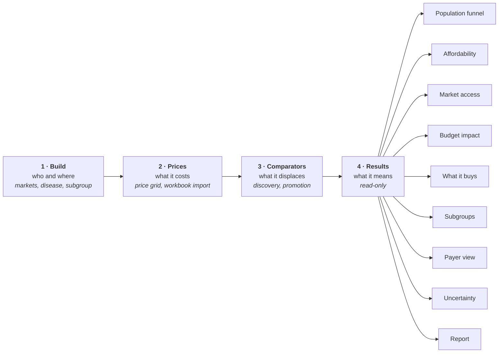

The order is the arithmetic: budget impact is **incremental** — world-with minus
world-without — so the world-without has to be complete before the subtraction
means anything. You cannot build a comparator basket before you know which
markets are in scope, you cannot compare against a therapy that has no price,
and a result computed before either is a result about the wrong world.

---

## 13. Scenario lifecycle

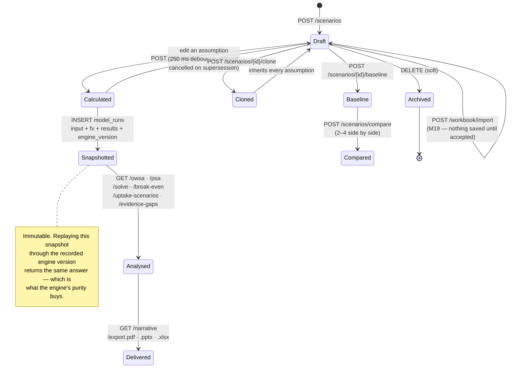

---

## Reading these against the code

| Diagram | Read alongside |
|---|---|
| 3, 4 | `data/ingestion/`, `docs/modules/M0-data-foundation.md` |
| 6 | `backend/tests/test_layering.py` — the layering is enforced, not documented |
| 7, 8 | `services/engine_input.py`, `services/resolution.py` |
| 9 | `backend/src/biet_engine/`, `backend/tests/engine/golden/` |
| 10 | `backend/src/biet_api/models/`, `backend/alembic/versions/` |
| 11 | `services/comparator_service.py`, `repositories/comparator.py` |
| 12 | `frontend/src/app/App.tsx`, `features/results/ResultsView.tsx` |
